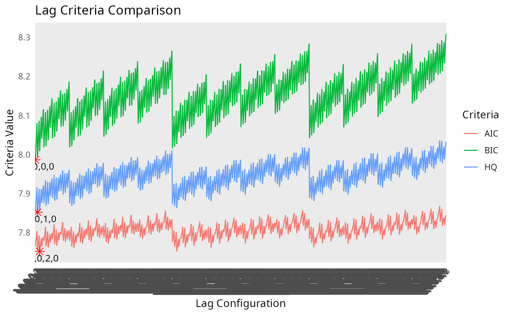
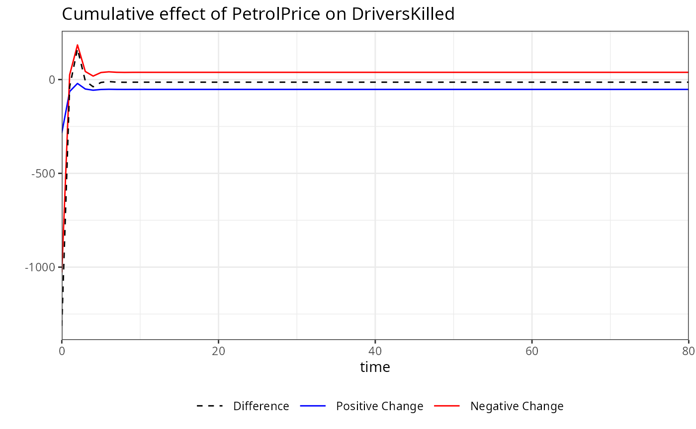
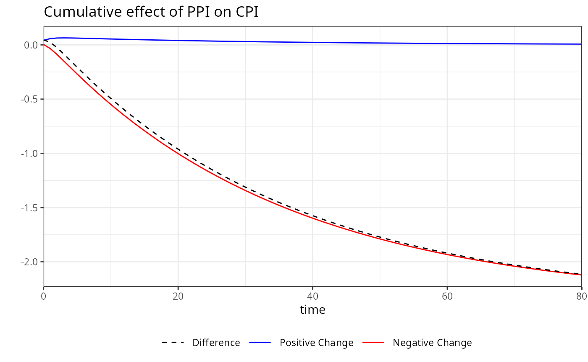
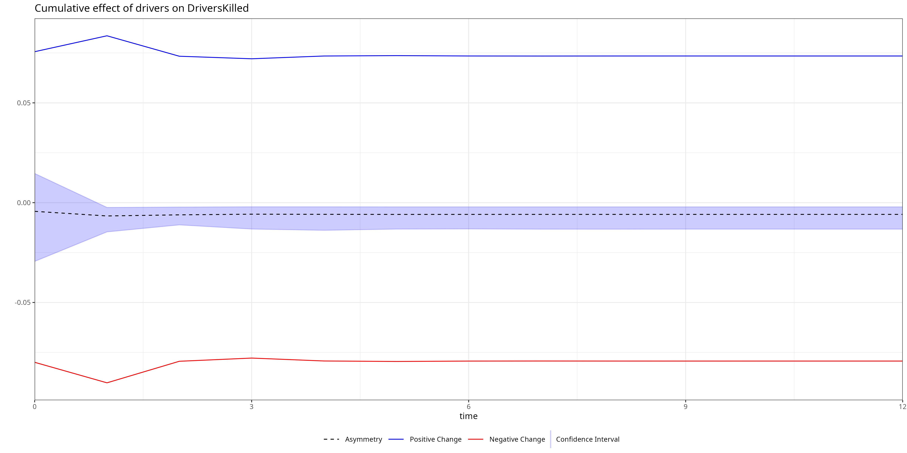

# Introduction to kardl

## Introduction

The `kardl` package is an R tool for estimating symmetric and asymmetric
Autoregressive Distributed Lag (ARDL) and Nonlinear ARDL (NARDL) models,
designed for econometricians and researchers analyzing cointegration and
dynamic relationships in time series data. It offers flexible model
specifications, allowing users to include deterministic variables,
asymmetric effects for short- and long-run dynamics, and trend
components. The package supports customizable lag structures, model
selection criteria (AIC, BIC, AICc, HQ), and parallel processing for
computational efficiency. Key features include:

- **Flexible Formula Specification**: Use `Asymmetric()`,
  `Lasymmetric()`, and `Sasymmetric()` to model asymmetric effects in
  short- and long-run dynamics, and `deterministic()` for dummy
  variables.
- **Lag Optimization**: Choose between automatic lag selection
  (`"quick"`, `"grid"`, `"grid_custom"`) or user-defined lags.
- **Dynamic Analysis**: Compute long-run coefficients, perform
  cointegration tests (PSS F, PSS t, Narayan), and ECM estimation.

This vignette demonstrates how to use the
[`kardl()`](../reference/kardl.md) function to estimate an asymmetric
ARDL model, perform diagnostic tests, and visualize results, using
economic data from Turkey.

## Installation

`kardl` in R can easily be installed from its CRAN repository:

``` r

install.packages("kardl")
library(kardl)
```

Alternatively, you can use the `devtools` package to load directly from
GitHub:

``` r

# Install required packages
install.packages(c("stats", "msm", "lmtest", "nlWaldTest", "car", "strucchange", "utils","ggplot2"))
# Install kardl from GitHub
install.packages("devtools")
devtools::install_github("karamelikli/kardl")
```

Load the package:

``` r

library(kardl)
```

## Estimating an Asymmetric ARDL Model

This example estimates an asymmetric ARDL model to analyze the dynamics
of exchange rate pass-through to domestic prices in Turkey, using a
sample dataset (`imf_example_data`) with variables for Consumer Price
Index (CPI), Exchange Rate (ER), Producer Price Index (PPI), and a
COVID-19 dummy variable.

### Step 1: Data Preparation

Assume `imf_example_data` contains monthly data for CPI, ER, PPI, and a
COVID dummy variable. We prepare the data by ensuring proper formatting
and adding the dummy variable. We retrieve data from the IMF’s
International Financial Statistics (IFS) dataset and prepare it for
analysis.

Note: The `imf_example_data` is a placeholder for demonstration
purposes. You should replace it with your actual dataset. The data can
be loaded by `readxl` or other data import functions.

### Step 2: Define the Model Formula

We define the model formula using R’s formula syntax, incorporating
asymmetric effects and deterministic variables. We use `asymmetric()`
for variables with both short- and long-run asymmetry, `Lasymmetric()`
for long-run asymmetry, `Sasymmetric()` for short-run asymmetry, and
`deterministic()` for fixed dummy variables. The `trend` term includes a
linear time trend in the model.

``` r

# Define the model formula
MyFormula <- CPI ~ ER + PPI + asymmetric(ER + PPI) + deterministic(covid) + trend
```

Indeed, the formula syntax is flexible, allowing for various
combinations of asymmetric and deterministic variables. The following
variations of the formula are equivalent and will yield the same model
specification:

``` r


sameFormula <- y ~Asymmetric(x1)+Sasymmetric(x2+x3)+Lasymmetric(x4+x5) + Deterministic(dummy1) + trend
sameFormula <- y ~asymmetric(x1)+Sasymmetric(x2+x3)+Lasymmetric(x4+x5) + deterministic(dummy1) + trend
sameFormula <- y ~asym(x1)+sasym(x2+x3)+lasym(x4+x5) + det(dummy1) + trend
sameFormula <- y ~a(x1)+s(x2+x3)+l(x4+x5) + d(dummy1) + trend
```

### Step 3: Model Estimation

We estimate the ARDL model using different `mode` settings to
demonstrate flexibility in lag selection. The
[`kardl()`](../reference/kardl.md) function supports various modes:
`"grid"`, `"grid_custom"`, `"quick"`, or a user-defined lag vector.

#### Using `mode = "grid"`

The `"grid"` mode evaluates all lag combinations up to `maxlag` and
provides console feedback.

``` r

# Set model options
kardl_set(criterion = "BIC", differentAsymLag = TRUE, data=imf_example_data)
# Estimate model with grid mode
kardl_model <- kardl(data=imf_example_data,formula= MyFormula, maxlag = 4, mode = "grid")
```

``` r

# View results
kardl_model
```

    ## Optimal lags for each variable ( BIC ):
    ## CPI: 1, ER_POS: 1, ER_NEG: 0, PPI_POS: 3, PPI_NEG: 0 
    ## 
    ## Call:
    ## L0.d.CPI ~ L1.CPI + L1.ER_POS + L1.ER_NEG + L1.PPI_POS + L1.PPI_NEG + 
    ##     L1.d.CPI + L0.d.ER_POS + L1.d.ER_POS + L0.d.ER_NEG + L0.d.PPI_POS + 
    ##     L1.d.PPI_POS + L2.d.PPI_POS + L3.d.PPI_POS + L0.d.PPI_NEG + 
    ##     covid + trend
    ## 
    ## Coefficients:
    ##  (Intercept)        L1.CPI     L1.ER_POS     L1.ER_NEG    L1.PPI_POS  
    ##   -0.0386634    -0.0121524     0.0110491     0.0252653     0.0517031  
    ##   L1.PPI_NEG      L1.d.CPI   L0.d.ER_POS   L1.d.ER_POS   L0.d.ER_NEG  
    ##    0.0451043     0.3340367     0.1111220     0.0937503    -0.0026591  
    ## L0.d.PPI_POS  L1.d.PPI_POS  L2.d.PPI_POS  L3.d.PPI_POS  L0.d.PPI_NEG  
    ##    0.0474102     0.0021468    -0.0519928    -0.0517409     0.0057550  
    ##        covid         trend  
    ##    0.0033275    -0.0002952

Summary of the model provides detailed information about the estimated
coefficients, standard errors, t-values, and significance levels.

``` r

# Display model summary
summary(kardl_model)
```

    ## 
    ## Call:
    ## L0.d.CPI ~ L1.CPI + L1.ER_POS + L1.ER_NEG + L1.PPI_POS + L1.PPI_NEG + 
    ##     L1.d.CPI + L0.d.ER_POS + L1.d.ER_POS + L0.d.ER_NEG + L0.d.PPI_POS + 
    ##     L1.d.PPI_POS + L2.d.PPI_POS + L3.d.PPI_POS + L0.d.PPI_NEG + 
    ##     covid + trend
    ## 
    ## Residuals:
    ##       Min        1Q    Median        3Q       Max 
    ## -0.050478 -0.008129 -0.000904  0.006918  0.102836 
    ## 
    ## Coefficients:
    ##                Estimate Std. Error t value Pr(>|t|)    
    ## (Intercept)  -0.0386634  0.0227251  -1.701 0.089572 .  
    ## L1.CPI       -0.0121524  0.0047287  -2.570 0.010494 *  
    ## L1.ER_POS     0.0110491  0.0051559   2.143 0.032652 *  
    ## L1.ER_NEG     0.0252653  0.0079538   3.177 0.001594 ** 
    ## L1.PPI_POS    0.0517031  0.0096244   5.372 1.25e-07 ***
    ## L1.PPI_NEG    0.0451043  0.0107631   4.191 3.35e-05 ***
    ## L1.d.CPI      0.3340367  0.0399191   8.368 7.54e-16 ***
    ## L0.d.ER_POS   0.1111220  0.0180412   6.159 1.63e-09 ***
    ## L1.d.ER_POS   0.0937503  0.0181990   5.151 3.88e-07 ***
    ## L0.d.ER_NEG  -0.0026591  0.0474028  -0.056 0.955291    
    ## L0.d.PPI_POS  0.0474102  0.0160401   2.956 0.003284 ** 
    ## L1.d.PPI_POS  0.0021468  0.0144158   0.149 0.881684    
    ## L2.d.PPI_POS -0.0519928  0.0143424  -3.625 0.000322 ***
    ## L3.d.PPI_POS -0.0517409  0.0137160  -3.772 0.000183 ***
    ## L0.d.PPI_NEG  0.0057550  0.0135155   0.426 0.670452    
    ## covid         0.0033275  0.0050899   0.654 0.513621    
    ## trend        -0.0002952  0.0002472  -1.194 0.233112    
    ## ---
    ## Signif. codes:  0 '***' 0.001 '**' 0.01 '*' 0.05 '.' 0.1 ' ' 1
    ## 
    ## Residual standard error: 0.01483 on 448 degrees of freedom
    ##   (5 observations deleted due to missingness)
    ## Multiple R-squared:  0.6516, Adjusted R-squared:  0.6392 
    ## F-statistic: 52.38 on 16 and 448 DF,  p-value: < 2.2e-16

#### Using User-Defined Lags

Specify custom lags to bypass automatic lag selection:

``` r

kardl_model2 <- kardl(data=imf_example_data, MyFormula, mode = c(2, 1, 1, 3, 0))
# View results
kardl_model2$lagInfo
```

    ## $OptLag
    ##     CPI  ER_POS  ER_NEG PPI_POS PPI_NEG 
    ##       2       1       1       3       0

``` r

# Display model summary
summary(kardl_model2)
```

    ## 
    ## Call:
    ## L0.d.CPI ~ L1.CPI + L1.ER_POS + L1.ER_NEG + L1.PPI_POS + L1.PPI_NEG + 
    ##     L1.d.CPI + L2.d.CPI + L0.d.ER_POS + L1.d.ER_POS + L0.d.ER_NEG + 
    ##     L1.d.ER_NEG + L0.d.PPI_POS + L1.d.PPI_POS + L2.d.PPI_POS + 
    ##     L3.d.PPI_POS + L0.d.PPI_NEG + covid + trend
    ## 
    ## Residuals:
    ##       Min        1Q    Median        3Q       Max 
    ## -0.054516 -0.008329 -0.001178  0.006787  0.104278 
    ## 
    ## Coefficients:
    ##                Estimate Std. Error t value Pr(>|t|)    
    ## (Intercept)  -0.0382834  0.0226694  -1.689 0.091962 .  
    ## L1.CPI       -0.0123942  0.0047187  -2.627 0.008921 ** 
    ## L1.ER_POS     0.0110505  0.0051609   2.141 0.032798 *  
    ## L1.ER_NEG     0.0268623  0.0080054   3.356 0.000860 ***
    ## L1.PPI_POS    0.0532642  0.0096979   5.492 6.67e-08 ***
    ## L1.PPI_NEG    0.0452663  0.0107751   4.201 3.21e-05 ***
    ## L1.d.CPI      0.3750078  0.0444934   8.428 4.88e-16 ***
    ## L2.d.CPI     -0.0865443  0.0423947  -2.041 0.041800 *  
    ## L0.d.ER_POS   0.1119077  0.0179998   6.217 1.16e-09 ***
    ## L1.d.ER_POS   0.0889105  0.0189930   4.681 3.79e-06 ***
    ## L0.d.ER_NEG  -0.0051813  0.0476798  -0.109 0.913515    
    ## L1.d.ER_NEG   0.0047909  0.0475913   0.101 0.919860    
    ## L0.d.PPI_POS  0.0487238  0.0160447   3.037 0.002532 ** 
    ## L1.d.PPI_POS -0.0010288  0.0144643  -0.071 0.943329    
    ## L2.d.PPI_POS -0.0544024  0.0143719  -3.785 0.000174 ***
    ## L3.d.PPI_POS -0.0499891  0.0137240  -3.642 0.000302 ***
    ## L0.d.PPI_NEG  0.0056668  0.0134844   0.420 0.674505    
    ## covid         0.0031412  0.0050898   0.617 0.537448    
    ## trend        -0.0003309  0.0002472  -1.338 0.181531    
    ## ---
    ## Signif. codes:  0 '***' 0.001 '**' 0.01 '*' 0.05 '.' 0.1 ' ' 1
    ## 
    ## Residual standard error: 0.01479 on 446 degrees of freedom
    ##   (5 observations deleted due to missingness)
    ## Multiple R-squared:  0.655,  Adjusted R-squared:  0.641 
    ## F-statistic: 47.03 on 18 and 446 DF,  p-value: < 2.2e-16

#### Using All Variables

Use the `.` operator to include all variables except the dependent
variable:

``` r

kardl_set(data=imf_example_data)
kardl(formula =  CPI ~ . + deterministic(covid), mode = "grid")
```

    ## Optimal lags for each variable ( BIC ):
    ## CPI: 1, ER: 1, PPI: 1 
    ## 
    ## Call:
    ## L0.d.CPI ~ L1.CPI + L1.ER + L1.PPI + L1.d.CPI + L0.d.ER + L1.d.ER + 
    ##     L0.d.PPI + L1.d.PPI + covid
    ## 
    ## Coefficients:
    ## (Intercept)       L1.CPI        L1.ER       L1.PPI     L1.d.CPI      L0.d.ER  
    ##   0.0721925   -0.0151379    0.0156144   -0.0017714    0.4453614    0.0995449  
    ##     L1.d.ER     L0.d.PPI     L1.d.PPI        covid  
    ##   0.0871452    0.0058383    0.0238530    0.0008534

#### Visualizing Lag Criteria

The `LagCriteria` component contains lag combinations and their
criterion values. We visualize these to compare model selection criteria
(AIC, BIC, HQ).

``` r

library(dplyr)
library(tidyr)
library(ggplot2)
# Convert LagCriteria to a data frame
LagCriteria <- as.data.frame(kardl_model$lagInfo$LagCriteria)
colnames(LagCriteria) <- c("lag", "AIC", "BIC", "AICc", "HQ")
LagCriteria <- LagCriteria %>% mutate(across(c(AIC, BIC, HQ), as.numeric))

# Pivot to long format
LagCriteria_long <- LagCriteria %>%
  select(-AICc) %>%
  pivot_longer(cols = c(AIC, BIC, HQ), names_to = "Criteria", values_to = "Value")

# Find minimum values
min_values <- LagCriteria_long %>%
  group_by(Criteria) %>%
  slice_min(order_by = Value) %>%
  ungroup()

# Plot
ggplot(LagCriteria_long, aes(x = lag, y = Value, color = Criteria, group = Criteria)) +
  geom_line() +
  geom_point(data = min_values, aes(x = lag, y = Value), color = "red", size = 3, shape = 8) +
  geom_text(data = min_values, aes(x = lag, y = Value, label = lag), vjust = 1.5, color = "black", size = 3.5) +
  labs(title = "Lag Criteria Comparison", x = "Lag Configuration", y = "Criteria Value") +
  theme_minimal() +
  theme(axis.text.x = element_text(angle = 45, hjust = 1))
```



#### Error Correction Model (ECM) Estimation

The [`ecm()`](../reference/ecm.md) function estimates a Restricted ECM
for cointegration testing. We specify the same formula and lag structure
as in the ARDL model.

``` r

ecm_model <- ecm(data=imf_example_data, formula = MyFormula, maxlag = 4, mode = "grid_custom")
# View results
summary(ecm_model)
```

    ## 
    ## Call:
    ## lm(formula = shortrunEQ, data = EcmData)
    ## 
    ## Residuals:
    ##       Min        1Q    Median        3Q       Max 
    ## -0.069034 -0.008966 -0.000360  0.007383  0.098004 
    ## 
    ## Coefficients:
    ##                Estimate Std. Error t value Pr(>|t|)    
    ## (Intercept)   1.840e-02  2.767e-03   6.650 8.50e-11 ***
    ## EcmRes       -7.988e-03  4.168e-03  -1.916 0.055947 .  
    ## L1.d.CPI      4.566e-01  3.738e-02  12.217  < 2e-16 ***
    ## L0.d.ER_POS   1.237e-01  1.863e-02   6.643 8.86e-11 ***
    ## L1.d.ER_POS   9.888e-02  1.895e-02   5.218 2.76e-07 ***
    ## L0.d.ER_NEG   4.782e-02  4.861e-02   0.984 0.325705    
    ## L0.d.PPI_POS  1.974e-02  1.524e-02   1.296 0.195793    
    ## L1.d.PPI_POS  2.079e-02  1.461e-02   1.423 0.155302    
    ## L2.d.PPI_POS -3.840e-02  1.460e-02  -2.631 0.008815 ** 
    ## L3.d.PPI_POS -3.676e-02  1.403e-02  -2.620 0.009085 ** 
    ## L0.d.PPI_NEG -6.570e-04  1.387e-02  -0.047 0.962248    
    ## covid         1.182e-02  3.231e-03   3.657 0.000285 ***
    ## trend        -4.622e-05  7.953e-06  -5.812 1.17e-08 ***
    ## ---
    ## Signif. codes:  0 '***' 0.001 '**' 0.01 '*' 0.05 '.' 0.1 ' ' 1
    ## 
    ## Residual standard error: 0.0156 on 452 degrees of freedom
    ## Multiple R-squared:  0.611,  Adjusted R-squared:  0.6007 
    ## F-statistic: 59.16 on 12 and 452 DF,  p-value: < 2.2e-16

### Step 4: Long-Run Coefficients

We calculate long-run coefficients using
[`kardl_longrun()`](../reference/kardl_longrun.md), which standardizes
coefficients by dividing them by the negative of the dependent
variable’s long-run parameter.

``` r

# Long-run coefficients
mylong <- kardl_longrun(kardl_model)
mylong
```

    ## 
    ## Call:
    ## kardl_longrun(model = kardl_model)
    ## 
    ## Coefficients:
    ##  L1.ER_POS   L1.ER_NEG  L1.PPI_POS  L1.PPI_NEG  
    ##     0.9092      2.0790      4.2545      3.7115

The [`summary()`](https://rdrr.io/r/base/summary.html) function provides
detailed information about the long-run coefficients, including standard
errors, t-values, and significance levels.

``` r

# Summary of long-run coefficients
summary(mylong)
```

    ## 
    ## Call:
    ## kardl_longrun(model = kardl_model)
    ## 
    ## Estimation type:
    ## Long-run multipliers 
    ## 
    ## Coefficients:
    ##            Estimate Std. Error t value  Pr(>|t|)    
    ## L1.ER_POS   0.90921    0.20834  4.3640 1.587e-05 ***
    ## L1.ER_NEG   2.07904    0.56693  3.6672 0.0002747 ***
    ## L1.PPI_POS  4.25455    1.72822  2.4618 0.0141998 *  
    ## L1.PPI_NEG  3.71155    1.33518  2.7798 0.0056681 ** 
    ## ---
    ## Signif. codes:  0 '***' 0.001 '**' 0.01 '*' 0.05 '.' 0.1 ' ' 1
    ## 
    ## Note:
    ## Coefficients, standard errors, t-statistics and p-values are reliably estimated.
    ## Fitted values and residuals are NOT centered (E(u) ≠ 0 by design) → diagnostic plots and residual-based tests are invalid.

### Step 5: Asymmetry Test

The [`symmetrytest()`](../reference/symmetrytest.md) function performs
Wald tests to assess short- and long-run asymmetry in the model.

``` r

ast <- imf_example_data %>% kardl(CPI ~ ER + PPI + asymmetric(ER + PPI) + deterministic(covid) + trend, mode = c(1, 2, 3, 0, 1)) %>% symmetrytest()
ast
```

    ## 
    ## Symmetry Test Results - Long-run:
    ## =======================
    ##     Df  Sum of Sq    Mean Sq F value Pr(>F)
    ## ER   1 0.00049756 0.00049756  2.1649 0.1419
    ## PPI  1 0.00016439 0.00016439  0.7153 0.3982
    ## 
    ## Symmetry Test Results - Short-run:
    ## =======================
    ##     Df  Sum of Sq    Mean Sq F value Pr(>F)
    ## ER   1 0.00038607 0.00038607  1.6798 0.1956
    ## PPI  1 0.00017426 0.00017426  0.7582 0.3844

Summary of the symmetry test provides detailed results for both long-run
and short-run asymmetry tests, including F-values, p-values, hypotheses,
and test decisions.

``` r

# Summary of symmetry test
summary(ast)
```

    ## Long-run symmetry tests:
    ## 
    ## Test for variable:  ER 
    ## F statistic: 2.164906, p-value: 0.1418984
    ## Test Decision:  Fail to Reject H0 at 5% level. Indicating long-run symmetry for variable ER. 
    ## Hypotheses:
    ## H0: - Coef(L1.ER_POS)/Coef(L1.CPI) = - Coef(L1.ER_NEG)/Coef(L1.CPI)
    ## H1: - Coef(L1.ER_POS)/Coef(L1.CPI) ≠ - Coef(L1.ER_NEG)/Coef(L1.CPI)
    ## 
    ## Test for variable:  PPI 
    ## F statistic: 0.7152717, p-value: 0.3981528
    ## Test Decision:  Fail to Reject H0 at 5% level. Indicating long-run symmetry for variable PPI. 
    ## Hypotheses:
    ## H0: - Coef(L1.PPI_POS)/Coef(L1.CPI) = - Coef(L1.PPI_NEG)/Coef(L1.CPI)
    ## H1: - Coef(L1.PPI_POS)/Coef(L1.CPI) ≠ - Coef(L1.PPI_NEG)/Coef(L1.CPI)
    ## 
    ## 
    ## _____________________________
    ## Short-run symmetry tests:
    ## 
    ## Test for variable:  ER 
    ## F  statistic:  1.679811 , p-value:  0.1956198 
    ## Test Decision:  Fail to Reject H0 at 5% level. Indicating short-run symmetry for variable ER. 
    ## Hypotheses:
    ## H0: Coef(L0.d.ER_POS) + Coef(L1.d.ER_POS) + Coef(L2.d.ER_POS) = Coef(L0.d.ER_NEG) + Coef(L1.d.ER_NEG) + Coef(L2.d.ER_NEG) + Coef(L3.d.ER_NEG)
    ## H1: Coef(L0.d.ER_POS) + Coef(L1.d.ER_POS) + Coef(L2.d.ER_POS) ≠ Coef(L0.d.ER_NEG) + Coef(L1.d.ER_NEG) + Coef(L2.d.ER_NEG) + Coef(L3.d.ER_NEG)
    ## 
    ## Test for variable:  PPI 
    ## F  statistic:  0.7582018 , p-value:  0.3843603 
    ## Test Decision:  Fail to Reject H0 at 5% level. Indicating short-run symmetry for variable PPI. 
    ## Hypotheses:
    ## H0: Coef(L0.d.PPI_POS) = Coef(L0.d.PPI_NEG) + Coef(L1.d.PPI_NEG)
    ## H1: Coef(L0.d.PPI_POS) ≠ Coef(L0.d.PPI_NEG) + Coef(L1.d.PPI_NEG)

### Step 6: Cointegration Tests

We perform cointegration tests to assess long-term relationships using
[`pssf()`](../reference/pssf.md), [`psst()`](../reference/psst.md), and
[`narayan()`](../reference/narayan.md).

#### PSS F Bound Test

The [`pssf()`](../reference/pssf.md) function tests for cointegration
using the Pesaran, Shin, and Smith F Bound test.

``` r

A <- kardl_model %>% pssf(case = 3, signif_level = "0.05")
A
```

    ## 
    ##  Pesaran-Shin-Smith (PSS) Bounds F-test for cointegration
    ## 
    ## data:  model
    ## F = 11.271
    ## alternative hypothesis: Cointegrating relationship exists

Summary of the PSS F Bound test provides detailed information about the
test statistic, critical values, hypotheses, and decision regarding
cointegration.

``` r

summary(A)
```

    ## Pesaran-Shin-Smith (PSS) Bounds F-test for cointegration 
    ## F  =  11.27056 
    ## k =  4 
    ## 
    ## Hypotheses:
    ## H0: Coef(L1.CPI) = Coef(L1.ER_POS) = Coef(L1.ER_NEG) = Coef(L1.PPI_POS) = Coef(L1.PPI_NEG) = 0 
    ## H1: Coef(L1.CPI) ≠ Coef(L1.ER_POS) ≠ Coef(L1.ER_NEG) ≠ Coef(L1.PPI_POS) ≠ Coef(L1.PPI_NEG)≠ 0 
    ## 
    ## Test Decision:  Reject H0 → Cointegration (at 5% level) 
    ## 
    ## Critical Values (Case  V ):
    ##          L    U
    ## 0.10  3.03 4.06
    ## 0.05  3.47 4.57
    ## 0.025 3.89 5.07
    ## 0.01  4.40 5.72
    ## 
    ## Notes:
    ##    • Trend detected in the model. Case automatically adjusted to 5 (unrestricted intercept and trend).

#### PSS t Bound Test

The [`psst()`](../reference/psst.md) function tests the significance of
the lagged dependent variable’s coefficient.

``` r

A <- kardl_model %>% psst(case = 3, signif_level = "0.05")
A
```

    ## 
    ##  Pesaran-Shin-Smith (PSS) Bounds t-test for cointegration
    ## 
    ## data:  model
    ## t = -2.5699
    ## alternative hypothesis: Cointegrating relationship exists

Summary of the PSS t Bound test provides detailed information about the
test statistic, critical values, hypotheses, and decision regarding
cointegration.

``` r

summary(A)
```

    ## Pesaran-Shin-Smith (PSS) Bounds t-test for cointegration 
    ## t  =  -2.569932 
    ## k =  4 
    ## 
    ## Hypotheses:
    ## H0: Coef(L1.CPI) = 0 
    ## H1: Coef(L1.CPI)≠ 0 
    ## 
    ## Test Decision:  Reject H0 → Cointegration (at 5% level) 
    ## 
    ## Critical Values (Case  V ):
    ##           L     U
    ## 0.10  -3.13 -4.04
    ## 0.05  -3.41 -4.36
    ## 0.025 -3.65 -4.62
    ## 0.01  -3.96 -4.96
    ## 
    ## Notes:
    ##    • Trend detected in the model. Case automatically adjusted to 5 (unrestricted intercept and trend).

#### Narayan Test

The [`narayan()`](../reference/narayan.md) function is tailored for
small sample sizes. It tests for cointegration using critical values
optimized for small samples.

``` r

A <- kardl_model %>% narayan(case = 3, signif_level = "0.05")
A
```

    ## 
    ##  Narayan F Test for Cointegration
    ## 
    ## data:  model
    ## F = 11.271
    ## alternative hypothesis: Cointegrating relationship exists

Summary of the Narayan test provides detailed information about the test
statistic, critical values, hypotheses, and decision regarding
cointegration.

``` r

summary(A)
```

    ## Narayan F Test for Cointegration 
    ## F  =  11.27056 
    ## k =  4 
    ## 
    ## Hypotheses:
    ## H0: Coef(L1.CPI) = Coef(L1.ER_POS) = Coef(L1.ER_NEG) = Coef(L1.PPI_POS) = Coef(L1.PPI_NEG) = 0 
    ## H1: Coef(L1.CPI) ≠ Coef(L1.ER_POS) ≠ Coef(L1.ER_NEG) ≠ Coef(L1.PPI_POS) ≠ Coef(L1.PPI_NEG)≠ 0 
    ## 
    ## Test Decision:  Reject H0 → Cointegration (at 5% level) 
    ## 
    ## Critical Values (Case  V ):
    ##          L     U
    ## 0.10 3.160 4.230
    ## 0.05 3.678 4.840
    ## 0.01 4.890 6.164
    ## 
    ## Notes:
    ##    • The Narayan F-test is designed for small samples. Your model uses only 469 observations. For greater accuracy with large samples, consider pssf() function. 
    ##    • Trend detected in the model. Case automatically adjusted to 5 (unrestricted intercept and trend).
    ##    • The number of observations exceeds the maximum limit for the critical values table. Using the critical values for 80 observations.

### Step 7: Dynamic Multipliers

The [`mplier()`](../reference/mplier.md) function calculates dynamic
multipliers for the model, showing how changes in independent variables
affect the dependent variable over time.

``` r

multipliers <- kardl_model %>% mplier()
# View multipliers of the model
head(multipliers$mpsi)
```

    ##      h    ER_POS       ER_NEG    ER_dif    PPI_POS      PPI_NEG     PPI_dif
    ## [1,] 0 0.1111220  0.002659096 0.1137811 0.04741019 -0.005755012  0.04165518
    ## [2,] 1 0.2516899 -0.021750322 0.2299396 0.11652070 -0.052711765  0.06380893
    ## [3,] 2 0.3066352 -0.054904985 0.2517302 0.13790041 -0.112860775  0.02503964
    ## [4,] 3 0.3323117 -0.090577971 0.2417337 0.14332835 -0.176685526 -0.03335717
    ## [5,] 4 0.3478993 -0.126658657 0.2212406 0.19510280 -0.240962483 -0.04585969
    ## [6,] 5 0.3599274 -0.162437060 0.1974903 0.26172949 -0.304609373 -0.04287988

``` r

# View long-run multipliers
head(multipliers$omega)
```

    ## [1]  1.3218843 -0.3340367

``` r

# View short-run multipliers
head(multipliers$lambda)
```

    ##            ER_POS       ER_NEG       PPI_POS     PPI_NEG
    ## [1,]  0.111122028 -0.002659096  0.0474101941 0.005755012
    ## [2,] -0.006322597  0.027924436  0.0064397124 0.039349293
    ## [3,] -0.093750322  0.000000000 -0.0541396294 0.000000000
    ## [4,]  0.000000000  0.000000000  0.0002518809 0.000000000
    ## [5,]  0.000000000  0.000000000  0.0517409420 0.000000000
    ## [6,]  0.000000000  0.000000000  0.0000000000 0.000000000

Plotting dynamic multipliers for specific variables can be done using
the [`plot()`](https://rdrr.io/r/graphics/plot.default.html) function,
which visualizes the response of the dependent variable to changes in
independent variables over time.

``` r

plot(multipliers, variables = c("ER", "PPI"))
```



To handle a large number of variables, you can specify a subset of
variables to plot or use `variables = "all"` to visualize all dynamic
multipliers.

Bootstrap confidence intervals for dynamic multipliers can be calculated
using the [`bootstrap()`](../reference/bootstrap.md) function, which
provides robust estimates of uncertainty around the multipliers.

``` r

bootstrap_results <- kardl_model %>%   bootstrap(horizon = 12,  replications= 10)
# View bootstrap summary
summary(bootstrap_results)
```

    ## Summary of Dynamic Multipliers
    ## Horizon: 12 
    ## 
    ##        h          ER_POS           ER_NEG              ER_dif      
    ##  Min.   : 0   Min.   :0.1111   Min.   :-0.396247   Min.   :0.0315  
    ##  1st Qu.: 3   1st Qu.:0.3323   1st Qu.:-0.299717   1st Qu.:0.1004  
    ##  Median : 6   Median :0.3706   Median :-0.197680   Median :0.1484  
    ##  Mean   : 6   Mean   :0.3467   Mean   :-0.195624   Mean   :0.1511  
    ##  3rd Qu.: 9   3rd Qu.:0.4001   3rd Qu.:-0.090578   3rd Qu.:0.2212  
    ##  Max.   :12   Max.   :0.4277   Max.   : 0.002659   Max.   :0.2517  
    ##     PPI_POS           PPI_NEG             PPI_dif           ER_CI_upper    
    ##  Min.   :0.04741   Min.   :-0.720251   Min.   :-0.045860   Min.   :0.1558  
    ##  1st Qu.:0.14333   1st Qu.:-0.548660   1st Qu.:-0.033357   1st Qu.:0.2040  
    ##  Median :0.33251   Median :-0.367272   Median :-0.004707   Median :0.2388  
    ##  Mean   :0.36104   Mean   :-0.362996   Mean   :-0.001957   Mean   :0.2449  
    ##  3rd Qu.:0.54395   3rd Qu.:-0.176686   3rd Qu.: 0.024956   3rd Qu.:0.2941  
    ##  Max.   :0.74521   Max.   :-0.005755   Max.   : 0.063809   Max.   :0.3333  
    ##   ER_CI_lower        PPI_CI_upper      PPI_CI_lower     
    ##  Min.   :-0.13109   Min.   :0.02179   Min.   :-0.19412  
    ##  1st Qu.:-0.02293   1st Qu.:0.04069   1st Qu.:-0.19122  
    ##  Median : 0.05582   Median :0.07289   Median :-0.18770  
    ##  Mean   : 0.05608   Mean   :0.06884   Mean   :-0.14912  
    ##  3rd Qu.: 0.15745   3rd Qu.:0.09263   3rd Qu.:-0.16366  
    ##  Max.   : 0.19002   Max.   :0.11741   Max.   : 0.01085

Vşsualize bootstrap results for specific variables to understand the
variability and confidence intervals of the dynamic multipliers.

``` r

plot(bootstrap_results, variables = "ER")
```



### Step 8: Customizing Asymmetric Variables

We demonstrate how to customize prefixes and suffixes for asymmetric
variables using [`kardl_set()`](../reference/kardl_set.md).

``` r

# Set custom prefixes and suffixes
kardl_reset()
kardl_set(AsymPrefix = c("asyP_", "asyN_"), AsymSuffix = c("_PP", "_NN"))
kardl_custom <- kardl(data=imf_example_data, MyFormula)
kardl_custom
```

    ## Optimal lags for each variable ( AIC ):
    ## CPI: 2, asyP_ER_PP: 1, asyN_ER_NN: 0, asyP_PPI_PP: 4, asyN_PPI_NN: 0 
    ## 
    ## Call:
    ## L0.d.CPI ~ L1.CPI + L1.asyP_ER_PP + L1.asyN_ER_NN + L1.asyP_PPI_PP + 
    ##     L1.asyN_PPI_NN + L1.d.CPI + L2.d.CPI + L0.d.asyP_ER_PP + 
    ##     L1.d.asyP_ER_PP + L0.d.asyN_ER_NN + L0.d.asyP_PPI_PP + L1.d.asyP_PPI_PP + 
    ##     L2.d.asyP_PPI_PP + L3.d.asyP_PPI_PP + L4.d.asyP_PPI_PP + 
    ##     L0.d.asyN_PPI_NN + covid + trend
    ## 
    ## Coefficients:
    ##      (Intercept)            L1.CPI     L1.asyP_ER_PP     L1.asyN_ER_NN  
    ##       -0.0404958        -0.0128695         0.0120635         0.0258122  
    ##   L1.asyP_PPI_PP    L1.asyN_PPI_NN          L1.d.CPI          L2.d.CPI  
    ##        0.0511977         0.0433195         0.3830822        -0.0920420  
    ##  L0.d.asyP_ER_PP   L1.d.asyP_ER_PP   L0.d.asyN_ER_NN  L0.d.asyP_PPI_PP  
    ##        0.1122301         0.0880910        -0.0017889         0.0509193  
    ## L1.d.asyP_PPI_PP  L2.d.asyP_PPI_PP  L3.d.asyP_PPI_PP  L4.d.asyP_PPI_PP  
    ##        0.0003349        -0.0535510        -0.0435529         0.0118365  
    ## L0.d.asyN_PPI_NN             covid             trend  
    ##       -0.0011170         0.0026926        -0.0003479

## Key Functions and Parameters

- **`kardl(data, model, maxlag, mode, ...)`**:

  - `data`: A time series dataset (e.g., a data frame with CPI, ER,
    PPI).
  - `formula`: A formula specifying the long-run equation, e.g.,
    `y ~ x + z + asymmetric(z) + Lasymmetric(x2 + x3) + Sasymmetric(x3 + x4) + deterministic(dummy1 + dummy2) + trend`.
    Supports:
    - `asymmetric()`: Asymmetric effects for both short- and long-run
      dynamics.
    - `Lasymmetric()`: Long-run asymmetric variables.
    - `Sasymmetric()`: Short-run asymmetric variables.
    - `deterministic()`: Fixed dummy variables.
    - `trend`: Linear time trend.
  - `maxlag`: Maximum number of lags (default: 4). Use smaller values
    (e.g., 2) for small datasets, larger values (e.g., 8) for long-term
    dependencies.
  - `mode`: Estimation mode:
    - `"quick"`: Verbose output for interactive use.
    - `"grid"`: Verbose output with lag optimization.
    - `"grid_custom"`: Silent, efficient execution.
    - User-defined vector (e.g., `c(1, 2, 4, 5)` or
      `c(CPI = 2, ER_POS = 3, ER_NEG = 1, PPI = 3)`).
  - Returns a list with components: `inputs`, `finalModel`,
    `start_time`, `end_time`, `properLag`, `TimeSpan`, `OptLag`,
    `LagCriteria`, `type` (“kardlmodel”).

- **`kardl_set(...)`**: Configures options like `criterion` (AIC, BIC,
  AICc, HQ), `differentAsymLag`, `AsymPrefix`, `Sasymuffix`,
  `ShortCoef`, and `LongCoef`. Use
  [`kardl_get()`](../reference/kardl_get.md) to retrieve settings and
  [`kardl_reset()`](../reference/kardl_reset.md) to restore defaults.

- **`kardl_longrun(model)`**: Calculates standardized long-run
  coefficients, returning `type` (“kardl_longrun”), `coef`, `delta_se`,
  `results`, and `starsDesc`.

- **`symmetrytest(model)`**: Performs Wald tests for short- and long-run
  asymmetry, returning `Lhypotheses`, `Lwald`, `Shypotheses`, `Swald`,
  and `type` (“symmetrytest”).

- **`pssf(model, case, signif_level)`**: Performs the Pesaran, Shin, and
  Smith F Bound test for cointegration, supporting cases 1–5 and
  significance levels (“auto”, 0.01, 0.025, 0.05, 0.1, 0.10).

- **`psst(model, case, signif_level)`**: Performs the PSS t Bound test,
  focusing on the lagged dependent variable’s coefficient.

- **`narayan(model, case, signif_level)`**: Conducts the Narayan test
  for cointegration, optimized for small samples (cases 2–5).

- **`ecm(data, model, maxlag, mode, ...)`**: Conducts the Restricted ECM
  test for cointegration, with similar parameters to
  [`kardl()`](../reference/kardl.md) and case/significance level
  options.

For detailed documentation, use [`?kardl`](../reference/kardl.md),
[`?kardl_set`](../reference/kardl_set.md),
[`?kardl_longrun`](../reference/kardl_longrun.md),
[`?symmetrytest`](../reference/symmetrytest.md),
[`?pssf`](../reference/pssf.md), [`?psst`](../reference/psst.md),
[`?narayan`](../reference/narayan.md), or [`?ecm`](../reference/ecm.md).

## Conclusion

The `kardl` package is a versatile tool for econometric analysis,
offering robust support for symmetric and asymmetric ARDL/NARDL
modeling, cointegration tests, stability diagnostics, and
heteroskedasticity checks. Its flexible formula specification, lag
optimization, and support for parallel processing make it ideal for
studying complex economic relationships. For more information, visit
<https://github.com/karamelikli/kardl> or contact the authors at
<hakperest@gmail.com>.

------------------------------------------------------------------------
